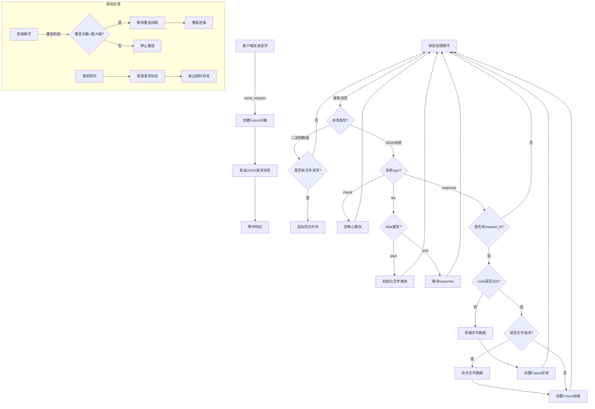

# WebSocket客户端消息处理流程

## 流程说明

### 1. 请求发送流程
- 创建Future对象等待响应
- 发送JSON格式的请求消息
- 等待响应或超时

### 2. 消息处理流程
- 二进制数据：直接追加到文件块（如果有文件请求）
- JSON消息根据type分类处理：
  - `check`：直接忽略
  - `file`：处理文件传输的开始和结束
  - `response`：处理响应结果

### 3. 文件传输流程
- start -> 初始化文件接收
- 接收字节数据 -> 追加到文件块
- end -> 等待最终response
- response -> 合并文件数据到响应中

### 4. 错误处理流程
- 连接断开：尝试重连
- 请求超时：清理状态并抛出异常
- 错误响应：清理文件数据并设置异常

## 关键特点
1. 所有消息处理都在一个循环中进行
2. 文件传输和普通请求使用相同的基础机制
3. 错误处理贯穿整个流程
4. 心跳包被直接忽略，不影响主要流程
